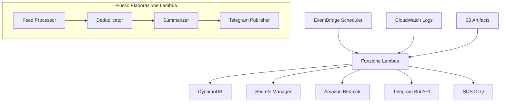

# Documento di Design: Another RSS Telegram Bot

## Panoramica

Another RSS Telegram Bot è un sistema serverless generico di riassunto RSS-to-Telegram costruito su AWS. Il sistema elabora feed RSS/Atom quotidianamente, genera riassunti in italiano utilizzando servizi AI con meccanismi di fallback, e li pubblica su canali Telegram. L'architettura enfatizza riutilizzabilità, deployment a comando singolo e principi infrastructure-as-code.

Il sistema è progettato per essere completamente generico - mentre include feed AWS di default, può essere facilmente configurato per qualsiasi fonte RSS e qualsiasi target Telegram senza modifiche al codice.

## Architettura

Il sistema segue un'architettura serverless event-driven:



**Componenti Chiave:**
- **EventBridge Scheduler**: Attiva esecuzione giornaliera alle 09:00 timezone Europe/Rome
- **Funzione Lambda**: Logica di elaborazione core (Python 3.12)
- **DynamoDB**: Deduplicazione contenuti con TTL di 90 giorni
- **Secrets Manager**: Storage sicuro per token bot Telegram
- **Amazon Bedrock**: Servizio AI primario per riassunti
- **SQS Dead Letter Queue**: Gestione errori e meccanismo retry
- **CloudWatch**: Logging e monitoraggio

## Componenti e Interfacce

### Feed Processor (`src/rss.py`)

**Responsabilità:**
- Scaricare feed RSS/Atom via HTTPS
- Parsare e normalizzare contenuto feed
- Estrarre dati strutturati da vari formati feed

**Interfaccia:**
```python
class FeedProcessor:
    def fetch_feeds(self, feed_urls: List[str]) -> List[FeedItem]
    def parse_feed(self, feed_url: str) -> List[FeedItem]
    def normalize_item(self, raw_item: dict) -> FeedItem
    def clean_html_content(self, content: str) -> str
```

**Caratteristiche Chiave:**
- Utilizza libreria `feedparser` per parsing RSS/Atom
- Gestisce sia formati RSS 2.0 che Atom 1.0
- Estrae: titolo, link, data pubblicazione, riassunto/contenuto
- Pulisce tag HTML dalle descrizioni
- Gestione errori robusta per feed malformati

### Deduplicator (`src/dedup.py`)

**Responsabilità:**
- Generare identificatori unici per elementi feed
- Controllare DynamoDB per contenuti esistenti
- Memorizzare nuovi elementi con TTL

**Interfaccia:**
```python
class Deduplicator:
    def generate_item_id(self, item: FeedItem) -> str
    def is_duplicate(self, item_id: str) -> bool
    def store_item(self, item_id: str, item: FeedItem) -> None
```

**Strategia Deduplicazione:**
1. Usa GUID elemento feed se disponibile
2. Fallback a SHA256(feed_url + link + published_date)
3. Memorizza in DynamoDB con TTL di 90 giorni
4. Salta elaborazione se elemento esiste già

### Summarizer (`src/summarize.py`)

**Responsabilità:**
- Generare riassunti in italiano utilizzando servizi AI
- Implementare meccanismi di fallback
- Formattare riassunti in modo consistente

**Interfaccia:**
```python
class Summarizer:
    def summarize(self, item: FeedItem) -> Summary
    def bedrock_summarize(self, content: str) -> str
    def fallback_summarize(self, content: str) -> str
    def format_summary(self, raw_summary: str) -> Summary
```

**Strategia AI:**
- **Primario**: Amazon Bedrock con Claude 3 Haiku (`anthropic.claude-3-haiku-20240307-v1:0`)
- **Fallback**: Riassunto estrattivo utilizzando ranking frasi
- **Formato**: 1 riga titolo + 3 punti elenco (≤15 parole ciascuno) + riga "Perché conta:" (≤20 parole)

**Template Prompt:**
```
Riassumi questo articolo in italiano seguendo questo formato:
- Una riga di titolo (massimo 10 parole)
- Tre punti elenco, ciascuno massimo 15 parole
- Una riga finale "Perché conta:" seguita da massimo 20 parole

Articolo: {content}

Non inventare informazioni non presenti nell'articolo.
```

### Telegram Publisher (`src/telegram.py`)

**Responsabilità:**
- Inviare messaggi formattati su Telegram
- Gestire rate limiting ed errori
- Formattare messaggi per leggibilità ottimale

**Interfaccia:**
```python
class TelegramPublisher:
    def send_message(self, summary: Summary, original_link: str) -> bool
    def format_message(self, summary: Summary, link: str) -> str
    def handle_rate_limit(self, retry_count: int) -> None
```

**Formato Messaggio:**
```html
<b>{title}</b>

• {bullet_1}
• {bullet_2}  
• {bullet_3}

<i>Perché conta:</i> {why_it_matters}

🔗 <a href="{original_link}">Leggi l'articolo completo</a>
```

**Gestione Errori:**
- Retry con backoff esponenziale per 429 (rate limiting)
- Logga errori e continua elaborazione per altri elementi
- Usa modalità parsing HTML per formattazione ricca

### Configuration Manager (`src/config.py`)

**Responsabilità:**
- Caricare configurazione da variabili ambiente
- Gestire URL feed di default
- Gestire parametri CloudFormation

**Interfaccia:**
```python
class Config:
    def get_feed_urls(self) -> List[str]
    def get_telegram_config(self) -> TelegramConfig
    def get_bedrock_config(self) -> BedrockConfig
    def get_schedule_config(self) -> ScheduleConfig
```

**Feed AWS di Default:**
```python
DEFAULT_AWS_FEEDS = [
    "https://aws.amazon.com/blogs/aws/feed/",
    "https://aws.amazon.com/about-aws/whats-new/recent/feed/",
    "https://aws.amazon.com/blogs/security/feed/",
    "https://aws.amazon.com/blogs/compute/feed/",
    "https://aws.amazon.com/blogs/database/feed/"
]
```

## Modelli Dati

### FeedItem
```python
@dataclass
class FeedItem:
    title: str
    link: str
    published: datetime
    content: str
    feed_url: str
    guid: Optional[str] = None
```

### Summary
```python
@dataclass
class Summary:
    title: str
    bullets: List[str]  # Max 3 elementi, 15 parole ciascuno
    why_it_matters: str  # Max 20 parole
```

### TelegramConfig
```python
@dataclass
class TelegramConfig:
    bot_token: str
    chat_id: str
    parse_mode: str = "HTML"
    retry_attempts: int = 3
    backoff_factor: float = 2.0
```

### Schema DynamoDB
```yaml
Tabella: rss-telegram-dedup
Chiave Partizione: item_id (String)
Attributi:
  - item_id: Identificatore unico
  - feed_url: URL feed sorgente
  - link: Link articolo originale
  - title: Titolo articolo
  - processed_at: Timestamp elaborazione
  - ttl: Timestamp scadenza (90 giorni)
```

## Proprietà di Correttezza

*Una proprietà è una caratteristica o comportamento che dovrebbe essere vero in tutte le esecuzioni valide di un sistema - essenzialmente, una dichiarazione formale su cosa il sistema dovrebbe fare. Le proprietà servono come ponte tra specifiche leggibili dall'uomo e garanzie di correttezza verificabili dalla macchina.*

Ora devo analizzare i criteri di accettazione per determinare quali possono essere testati come proprietà:

Basandomi sull'analisi dei criteri di accettazione, ecco le proprietà di correttezza testabili:

### Proprietà 1: Configurazione Feed Personalizzabili
*Per qualsiasi* lista di URL feed fornita come parametro di configurazione, il sistema dovrebbe elaborare esattamente quei feed e non altri
**Valida: Requisiti 1.1, 11.5**

### Proprietà 2: Utilizzo Chat ID Configurabile
*Per qualsiasi* ID chat Telegram configurato, tutti i messaggi dovrebbero essere inviati a quell'ID specifico
**Valida: Requisiti 1.2**

### Proprietà 3: Download HTTPS Obbligatorio
*Per tutti* gli URL feed elaborati, il sistema dovrebbe utilizzare esclusivamente protocollo HTTPS
**Valida: Requisiti 4.1**

### Proprietà 4: Estrazione Campi Completa
*Per qualsiasi* elemento feed valido, l'output normalizzato dovrebbe contenere titolo, link, data pubblicazione e contenuto
**Valida: Requisiti 4.2**

### Proprietà 5: Pulizia HTML
*Per qualsiasi* contenuto feed con tag HTML, l'output dovrebbe essere privo di markup HTML
**Valida: Requisiti 4.3**

### Proprietà 6: Resilienza Errori Feed
*Per qualsiasi* lista di feed contenente sia feed validi che malformati, il sistema dovrebbe elaborare tutti i feed validi senza interruzioni
**Valida: Requisiti 4.5, 10.4**

### Proprietà 7: Utilizzo GUID per Deduplicazione
*Per qualsiasi* elemento feed con GUID presente, l'identificatore unico dovrebbe essere basato sul GUID
**Valida: Requisiti 5.1**

### Proprietà 8: Hash Fallback per Deduplicazione
*Per qualsiasi* elemento feed senza GUID, l'identificatore unico dovrebbe essere un hash SHA256 di URL feed, link e data pubblicazione
**Valida: Requisiti 5.2**

### Proprietà 9: Prevenzione Duplicati
*Per qualsiasi* elemento già presente in DynamoDB, il sistema dovrebbe saltare l'elaborazione
**Valida: Requisiti 5.3, 5.4**

### Proprietà 10: Storage con TTL
*Per qualsiasi* nuovo elemento elaborato, dovrebbe essere memorizzato in DynamoDB con TTL di 90 giorni
**Valida: Requisiti 5.5**

### Proprietà 11: Formato Riassunto Consistente
*Per qualsiasi* riassunto generato, dovrebbe contenere esattamente: 1 titolo, 3 punti elenco (≤15 parole ciascuno), 1 riga "Perché conta:" (≤20 parole)
**Valida: Requisiti 6.2**

### Proprietà 12: Fallback Summarizer
*Per qualsiasi* errore di Bedrock (AccessDenied o indisponibilità), il sistema dovrebbe utilizzare il metodo di riassunto fallback
**Valida: Requisiti 6.3**

### Proprietà 13: Inclusione Link Originale
*Per qualsiasi* messaggio Telegram inviato, dovrebbe contenere il link all'articolo originale
**Valida: Requisiti 7.2**

### Proprietà 14: Retry Rate Limiting
*Per qualsiasi* errore 429 da Telegram API, il sistema dovrebbe implementare retry con backoff esponenziale
**Valida: Requisiti 7.3**

### Proprietà 15: Resilienza Errori Telegram
*Per qualsiasi* errore Telegram API, il sistema dovrebbe continuare l'elaborazione di altri messaggi
**Valida: Requisiti 7.4**

### Proprietà 16: Sicurezza Token
*Per qualsiasi* operazione che richiede il token Telegram, dovrebbe essere recuperato esclusivamente da AWS Secrets Manager
**Valida: Requisiti 9.1**

### Proprietà 17: Protezione Informazioni Sensibili
*Per qualsiasi* log generato, non dovrebbe contenere token, password o altre informazioni sensibili
**Valida: Requisiti 9.2**

### Proprietà 18: Logging Completo
*Per qualsiasi* esecuzione del sistema, dovrebbero essere presenti log per inizio, fine e tutti i passi intermedi
**Valida: Requisiti 8.4, 10.3**

## Gestione Errori

Il sistema implementa una strategia di gestione errori a più livelli:

### Livello Feed
- Errori di download: log e continua con feed successivo
- Errori di parsing: log e continua con feed successivo
- Timeout: retry con backoff, poi continua

### Livello Elaborazione
- Errori DynamoDB: retry con backoff esponenziale
- Errori Bedrock: fallback automatico a riassunto estrattivo
- Errori Telegram: retry per rate limiting, log per altri errori

### Livello Sistema
- Errori critici: invio a SQS Dead Letter Queue
- Metriche CloudWatch per monitoraggio
- Logging strutturato per debugging

## Strategia di Testing

### Testing Duale
Il sistema utilizza un approccio di testing complementare:

**Test Unitari:**
- Esempi specifici e casi limite
- Integrazione tra componenti
- Condizioni di errore specifiche

**Test Property-Based:**
- Proprietà universali su tutti gli input
- Copertura completa input tramite randomizzazione
- Minimo 100 iterazioni per test property

### Configurazione Property Testing
- Libreria: `hypothesis` per Python
- Tag formato: **Feature: another-rss-telegram-bot, Property {numero}: {testo_proprietà}**
- Ogni proprietà di correttezza implementata da UN SINGOLO test property-based
- Generatori intelligenti per feed RSS/Atom validi e malformati

### Bilanciamento Test Unitari
- Focus su esempi specifici che dimostrano comportamento corretto
- Punti di integrazione tra componenti
- Casi limite e condizioni di errore
- I test property-based gestiscono la copertura di molti input

**Esempi Test Unitari:**
- Parsing feed RSS 2.0 specifico
- Parsing feed Atom 1.0 specifico
- Gestione feed vuoto
- Gestione errore 429 Telegram
- Fallback Bedrock con contenuto specifico

**Esempi Test Property-Based:**
- Per qualsiasi feed valido, estrazione campi completa
- Per qualsiasi contenuto HTML, pulizia completa
- Per qualsiasi elemento con GUID, utilizzo GUID per ID
- Per qualsiasi riassunto, formato consistente