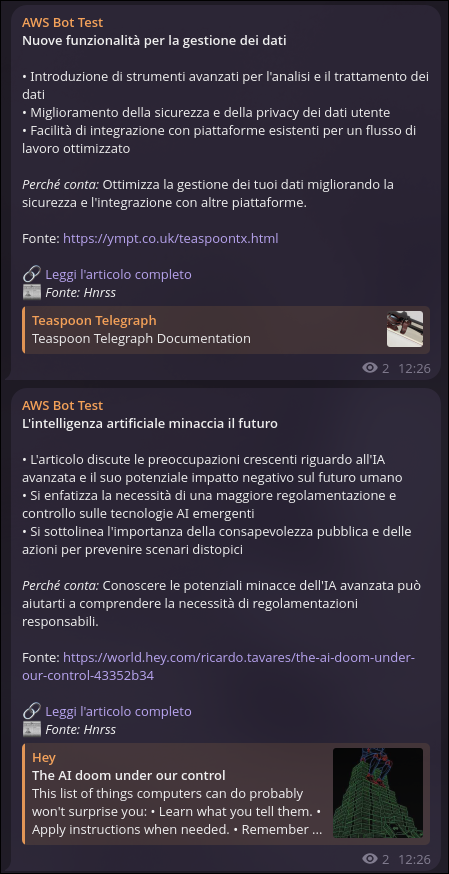

# Another RSS Telegram Bot

A generic, reusable serverless bot that monitors RSS feeds and sends automatic updates to configured Telegram channels.

> **Available languages**: [English (current)](README.md) | [Italiano](README.IT.md)

## Overview

This project is a **Kiro AI experiment** exploring AI-assisted development from requirements specification to implementation and testing. The system is completely generic and deployable to AWS with infrastructure automation.

### Key Features

- **RSS Monitoring**: Periodic checking of configurable RSS feeds
- **24-Hour Filter**: Processes only items published in the last 24 hours
- **Deduplication**: Prevents duplicate content using DynamoDB
- **AI Summaries**: Generates Italian summaries using Amazon Bedrock Nova Micro with fallback
- **Telegram Integration**: Automatic formatted message delivery
- **Error Handling**: Robust error management with Dead Letter Queue
- **Structured Logging**: Complete logging system for debugging
- **Monitoring**: CloudWatch dashboard and custom metrics
- **CI/CD Pipeline**: Automated deployment with AWS CodePipeline and S3

### AI Models

The bot supports three Amazon Bedrock models for generating Italian summaries. You can choose which model to use at deployment time:

**Default: Amazon Nova Micro** (`amazon.nova-micro-v1:0`)
- Cost-effective for high-volume summarization
- Fast response times (< 1 second per summary)
- Good quality Italian translations
- Available via cross-region inference profile
- Deploy with: `./scripts/deploy.sh -m nova-micro`

**Premium: Mistral Large** (intelligent regional selection)
- Excellent multilingual translation (EN→IT, FR, ES, DE)
- Superior reasoning and context understanding
- Uses Mistral Large 3 (675B MoE) in 6 regions, Large 24.02 in others
- Best for quality-focused deployments
- Cost: ~$0.78/month for 150 articles
- Deploy with: `./scripts/deploy.sh -m mistral-large`

**Alternative: Llama 3.2 3B Instruct** (`us.meta.llama3-2-3b-instruct-v1:0`)
- Excellent for summaries and translations
- Better instruction following
- Superior Italian quality
- Slightly higher cost but better results
- Deploy with: `./scripts/deploy.sh -m llama-3b`

For detailed model comparison, configuration options, and choosing the right model for your use case, see the [AI Models Guide](docs/MODELS.md).

### Example Output

Here's what the bot's messages look like in Telegram:



Each message includes:
- A concise Italian title
- Three bullet points with key information
- A "Perché conta:" section explaining relevance
- Source link to the original article

## Architecture

Serverless system on AWS with the following components:

### AWS Components
- **Lambda Function**: Main processing logic (Python 3.12)
- **DynamoDB**: Deduplication storage with 90-day TTL
- **EventBridge Scheduler**: Daily scheduled execution
- **Secrets Manager**: Secure Telegram token storage
- **Amazon Bedrock**: AI summary generation with Nova Micro model
- **SQS Dead Letter Queue**: Error handling and retry
- **CloudWatch**: Logging, metrics, and monitoring dashboard
- **CodePipeline**: Automated build and deployment (CI/CD)
- **S3**: Artifact storage and pipeline automation

### Code Components
- `src/lambda_handler.py`: Main entry point and orchestration
- `src/rss.py`: RSS feed management with feedparser
- `src/telegram.py`: Telegram Bot API integration
- `src/summarize.py`: Summary generation with Bedrock and fallback
- `src/dedup.py`: DynamoDB deduplication system
- `src/config.py`: Configuration and environment management
- `src/models.py`: Data models and structures

## Quick Start

### Prerequisites

- AWS CLI configured with appropriate credentials
- Python 3.12 or compatible
- Bot created via Telegram @BotFather
- GitHub repository (for CodePipeline integration)

### Deployment

The system uses a unified CloudFormation stack with AWS CodePipeline for automated deployment. A single stack contains all resources (Lambda, DynamoDB, EventBridge, CodePipeline, CodeBuild, etc.). See [docs/INFRASTRUCTURE.md](docs/INFRASTRUCTURE.md) for complete setup instructions.

## Configuration

### RSS Feeds

The bot reads RSS feeds from a `feeds.json` file. You can customize which feeds to monitor by editing this file or providing your own.

**Default feeds** include AWS-related content. See [FEEDS.md](FEEDS.md) for complete documentation on:
- Feed file format
- How to customize feeds
- Examples for different use cases

### Default RSS Feeds

The default `feeds.json` includes these AWS feeds:
- AWS Blog: `https://aws.amazon.com/blogs/aws/feed/`
- AWS What's New: `https://aws.amazon.com/about-aws/whats-new/recent/feed/`
- AWS Security Blog: `https://aws.amazon.com/blogs/security/feed/`
- AWS Compute Blog: `https://aws.amazon.com/blogs/compute/feed/`
- AWS Database Blog: `https://aws.amazon.com/blogs/database/feed/`

### Customization

You can customize feeds by:
1. Editing the `feeds.json` file in the project root
2. Providing a custom feeds file during deployment

See [FEEDS.md](FEEDS.md) for detailed instructions and examples.

## Quick Start

### Prerequisites

- **AWS Account**: Active AWS account with appropriate permissions
- **AWS CLI**: Installed and configured with your credentials
  ```bash
  # Configure AWS CLI with your credentials
  aws configure
  # Or use AWS_PROFILE environment variable
  export AWS_PROFILE=your-profile-name
  ```
- **Python 3.12** or compatible
- **Bot created** via Telegram @BotFather
- **Bedrock Access**: Ensure you have access to Amazon Bedrock models in your region

### Deployment

```bash
# Initial deployment with default model (Nova Micro)
./scripts/deploy.sh \
  --telegram-token "YOUR_BOT_TOKEN" \
  --chat-id "YOUR_CHAT_ID"

# Deploy with Llama 3.2 3B for better quality
./scripts/deploy.sh \
  --telegram-token "YOUR_BOT_TOKEN" \
  --chat-id "YOUR_CHAT_ID" \
  --model llama-3b

# Or with custom feeds file
./scripts/deploy.sh \
  --telegram-token "YOUR_BOT_TOKEN" \
  --chat-id "YOUR_CHAT_ID" \
  --feeds-file /path/to/my-feeds.json

# Skip confirmation prompts
./scripts/deploy.sh \
  --telegram-token "YOUR_BOT_TOKEN" \
  --chat-id "YOUR_CHAT_ID" \
  --yes
```

**Model Selection:**
- Omit `--model` or use `--model nova-micro` for cost-effective deployment (default)
- Use `--model llama-3b` for higher quality Italian summaries

For complete deployment instructions and model comparison, see [docs/INFRASTRUCTURE.md](docs/INFRASTRUCTURE.md) and [docs/MODELS.md](docs/MODELS.md).

## Documentation

- [RSS Feeds Configuration](FEEDS.md) - How to configure and customize RSS feeds
- [Infrastructure Guide](docs/INFRASTRUCTURE.md) - Complete infrastructure setup
- [AI Models Guide](docs/MODELS.md) - Model comparison, selection, and configuration
- [Kiro Development Process](docs/KIRO-PROMPT.md) - AI-assisted development methodology
- [Prompts](prompts/README.md) - AI prompt templates
- [Deployment Scripts](scripts/README.md) - Deployment automation documentation

## Development Methodology

This project was developed using **spec-driven development** with Kiro AI:

- ✅ Complete requirements specification using EARS format
- ✅ Architectural design with correctness properties
- ✅ Property-based testing implementation
- ✅ Automated testing with Hypothesis for Python
- ✅ Infrastructure-as-Code with CloudFormation
- ✅ Automated deployment with CodePipeline

## License

This project is licensed under the [Creative Commons Attribution-NonCommercial 4.0 International License (CC BY-NC 4.0)](LICENSE).

You are free to:
- Use, copy, and modify this software for non-commercial purposes
- Share and distribute the software

Under the following terms:
- Attribution: You must give appropriate credit
- NonCommercial: You may not use the material for commercial purposes

For commercial use, please contact the author.

---

*Developed as an experiment with Kiro AI Assistant*
